# Orchestrator Client - Intelligent Agent Command Line Interface

A command-line client for interacting with the Aichestra Multi-Agent System. **Best used with the [intelligent orchestrator agent](../orchestrator/README.md)** for seamless agent interactions and intelligent routing.

## 🚀 **Smart Orchestrator Integration**

The client now supports **intelligent agent routing**:

### Automatic Agent Selection
```bash
# Intelligent routing to best agent
> "Convert 100 USD to EUR"          → Currency Agent (100% confidence)
> "What is 2+3?"                    → Math Agent (95% confidence)  
> "List ArgoCD applications"        → ArgoCD Agent (100% confidence)
```

### Dynamic Agent Discovery
```bash
# Discover available agents
> LIST_AGENTS                       → Show all registered agents
> REGISTER_AGENT:http://localhost:8001 → Register a new agent
> UNREGISTER_AGENT:http://localhost:8001 → Unregister an existing agent
> UNREGISTER_AGENT:currency         → Remove agent
```

## 🏗️ System Integration

The client integrates with the orchestrator system for intelligent routing:

```mermaid
graph TD
    A[User Input] --> B[🔧 Orchestrator Client]
    B --> C[🤖 Smart Orchestrator]
    C --> D[A2A Card Resolver]
    D --> E[Skill Analysis]
    E --> F{Confidence Scoring}
    F -->|High Score| G[Route to Best Agent]
    F -->|Low Score| H[Fallback Response]
    
    G --> I[☸️ ArgoCD Agent]
    G --> J[💰 Currency Agent]
    G --> K[🧮 Math Agent]
    
    I --> L[Response]
    J --> L
    K --> L
    L --> B
    B --> M[Formatted Output]
    
    subgraph "Intelligent Routing"
        C
        D
        E
        F
        G
    end
    
    subgraph "Agent Ecosystem"
        I
        J
        K
    end
```



## ✨ Key Features

### 🤖 Intelligent Agent Routing
- **Automatic Selection**: Routes to the best agent based on request content
- **Confidence Scoring**: Shows routing confidence and reasoning
- **Real-time Discovery**: Discovers available agents dynamically
- **Skill-Based Matching**: Matches requests to agent capabilities

### 💬 Enhanced User Experience
- **Natural Language**: Interact using plain English
- **Clean Responses**: Formatted output instead of raw JSON
- **Agent Discovery**: Displays available agents and their capabilities
- **Session Management**: Maintains conversation context

### 🔧 Advanced Client Features
- **WebSocket Support**: Real-time push notifications
- **History Tracking**: Optional conversation history
- **Custom Headers**: Support for authentication and metadata
- **Flexible Configuration**: Multiple connection options

## 🚀 Quick Start

### Option 1: Intelligent Orchestrator (Recommended)

Connect to the orchestrator for intelligent agent routing:

```bash
# Terminal 1: Start Currency Agent
cd currencyAgent && uv run -m app

# Terminal 2: Start Math Agent  
cd mathAgent && uv run -m app

# Terminal 3: Start ArgoCD Agent
cd argocdAgent && uv run -m app

# Terminal 4: Start Orchestrator
cd orchestrator && uv run -m app

# Terminal 5: Connect Client
cd orchestrator_client && uv run . --agent http://localhost:8000

# Natural language interactions:
# > "Convert 100 USD to EUR"         → Currency Agent (100%)
# > "What is 2+3?"                   → Math Agent (95%)
# > "List ArgoCD applications"       → ArgoCD Agent (100%)
```

### Option 2: Direct Agent Connection

Connect directly to a specific agent:

```bash
# Connect to ArgoCD agent directly
uv run . --agent http://localhost:8001

# Connect to Currency agent directly
uv run . --agent http://localhost:8002

# Connect to Math agent directly  
uv run . --agent http://localhost:8003
```

### Option 3: Custom Agent

Connect to any A2A-compatible agent:

```bash
uv run . --agent http://your-custom-agent:port
```

## 📖 Usage Options

### Prerequisites

- Python 3.10+ (required for A2A SDK compatibility)
- A running A2A agent server (orchestrator recommended)
- uv package manager

### Installation

```bash
cd orchestrator_client
uv sync
```

### Command Line Options

```bash
# Basic usage
uv run . --agent http://localhost:8000

# With custom session ID
uv run . --agent http://localhost:8000 --session 12345

# With history tracking
uv run . --agent http://localhost:8000 --history

# With push notifications
uv run . --agent http://localhost:8000 --use_push_notifications

# With custom headers
uv run . --agent http://localhost:8000 --header "Authorization=Bearer token"

# With custom push notification receiver
uv run . --agent http://localhost:8000 --push_notification_receiver http://localhost:5000
```

## 🧪 Interactive Experience

### Agent Discovery Display

Once connected, you'll see available agents:

```console
% uv run . --agent http://localhost:8000
Will use headers: {}
======= Agent Card ========
{"capabilities":{"pushNotifications":true,"stateTransitionHistory":false,"streaming":false},"defaultInputModes":["text"],"defaultOutputModes":["text"],"description":"Intelligent agent that routes requests to specialized agents using LangGraph and A2A protocol","name":"Smart Orchestrator Agent","skills":[{"description":"Intelligent request routing to specialized agents","id":"request_routing","name":"Request Routing","tags":["routing","orchestration"]},{"description":"Multi-agent system coordination and management","id":"agent_coordination","name":"Agent Coordination","tags":["coordination","management"]},{"description":"Skill-based agent selection and matching","id":"skill_matching","name":"Skill Matching","tags":["matching","selection"]},{"description":"Confidence scoring for routing decisions","id":"confidence_scoring","name":"Confidence Scoring","tags":["scoring","confidence"]}],"url":"http://localhost:8000/","version":"1.0.0"}

============================================================
🤖 AVAILABLE AGENTS
============================================================
Found 3 available agents:

1. ArgoCD Agent (http://localhost:8001)
   Description: Handles ArgoCD and Kubernetes operations via MCP protocol
   Skills: Kubernetes Management, GitOps, Application Deployment (+3 more)

2. Currency Agent (http://localhost:8002/)
   Description: Handles currency exchange and financial data
   Skills: Currency exchange operations, Financial data analysis, Market analysis and trends (+2 more)

3. Math Agent (http://localhost:8003/)
   Description: Advanced mathematical assistant for calculations, equation solving, calculus, statistics, and matrix operations via MCP
   Skills: Arithmetic Calculation, Equation Solving, Calculus Operations (+2 more)

============================================================
💡 The orchestrator will automatically route your requests to the best agent!
============================================================
=========  starting a new task ========

What do you want to send to the agent? (:q or quit to exit):
```

### Intelligent Routing Examples

```bash
# Financial operations → Currency Agent
> "Convert 100 USD to EUR"
🎯 Routing to Currency Agent (100% confidence)
💰 Response: 100 USD = 85.32 EUR (current rate: 0.8532)

# Mathematical operations → Math Agent  
> "What is 2+3?"
🎯 Routing to Math Agent (95% confidence)
🧮 Response: 2 + 3 = 5

# Kubernetes operations → ArgoCD Agent
> "List all applications"
🎯 Routing to ArgoCD Agent (100% confidence)
☸️ Response: Found 5 applications: guestbook, web-app, api-service...
```

### Agent Register

```console
% uv run . --register_agent http://localhost:8003
Will use headers: {}
======= Agent Card ========
{"capabilities":{"pushNotifications":true,"stateTransitionHistory":false,"streaming":false},"defaultInputModes":["text"],"defaultOutputModes":["text"],"description":"Intelligent agent that routes requests to specialized agents using LangGraph and A2A protocol","name":"Smart Orchestrator Agent","skills":[{"description":"Intelligent request routing to specialized agents","id":"request_routing","name":"Request Routing","tags":["routing","orchestration"]},{"description":"Multi-agent system coordination and management","id":"agent_coordination","name":"Agent Coordination","tags":["coordination","management"]},{"description":"Skill-based agent selection and matching","id":"skill_matching","name":"Skill Matching","tags":["matching","selection"]},{"description":"Confidence scoring for routing decisions","id":"confidence_scoring","name":"Confidence Scoring","tags":["scoring","confidence"]}],"url":"http://localhost:8000/","version":"1.0.0"}
🔄 Registering agent http://localhost:8003 with orchestrator http://localhost:8000
📤 Sending registration request...
🎉 Registration completed successfully!
📄 ✅ Successfully registered Math Agent from http://localhost:8003
Agent ID: Math Agent
Agent Name: Math Agent
Total agents: 3
```

### Agent Unregister

```console
% uv run . --unregister_agent http://localhost:8003
Will use headers: {}
======= Agent Card ========
{"capabilities":{"pushNotifications":true,"stateTransitionHistory":false,"streaming":false},"defaultInputModes":["text"],"defaultOutputModes":["text"],"description":"Intelligent agent that routes requests to specialized agents using LangGraph and A2A protocol","name":"Smart Orchestrator Agent","skills":[{"description":"Intelligent request routing to specialized agents","id":"request_routing","name":"Request Routing","tags":["routing","orchestration"]},{"description":"Multi-agent system coordination and management","id":"agent_coordination","name":"Agent Coordination","tags":["coordination","management"]},{"description":"Skill-based agent selection and matching","id":"skill_matching","name":"Skill Matching","tags":["matching","selection"]},{"description":"Confidence scoring for routing decisions","id":"confidence_scoring","name":"Confidence Scoring","tags":["scoring","confidence"]}],"url":"http://localhost:8000/","version":"1.0.0"}
🔄 Unregistering agent http://localhost:8003 from orchestrator http://localhost:8000
📤 Sending unregistration request...
🎉 Unregistration completed successfully!
📄 ✅ Successfully unregistered Math Agent (ID: Math Agent)
Agent ID: Math Agent
Remaining agents: 2
```

### Agent List

```console
% uv run  . --list_agent
Will use headers: {}
======= Agent Card ========
{"capabilities":{"pushNotifications":true,"stateTransitionHistory":false,"streaming":false},"defaultInputModes":["text"],"defaultOutputModes":["text"],"description":"Intelligent agent that routes requests to specialized agents using LangGraph and A2A protocol","name":"Smart Orchestrator Agent","skills":[{"description":"Intelligent request routing to specialized agents","id":"request_routing","name":"Request Routing","tags":["routing","orchestration"]},{"description":"Multi-agent system coordination and management","id":"agent_coordination","name":"Agent Coordination","tags":["coordination","management"]},{"description":"Skill-based agent selection and matching","id":"skill_matching","name":"Skill Matching","tags":["matching","selection"]},{"description":"Confidence scoring for routing decisions","id":"confidence_scoring","name":"Confidence Scoring","tags":["scoring","confidence"]}],"url":"http://localhost:8000/","version":"1.0.0"}

============================================================
🤖 AVAILABLE AGENTS
============================================================
Found 3 available agents:

1. ArgoCD Agent (http://localhost:8001)
   Description: Handles ArgoCD and Kubernetes operations via MCP protocol
   Skills: Kubernetes Management, GitOps, Application Deployment (+3 more)

2. Currency Agent (http://localhost:8002/)
   Description: Handles currency exchange and financial data
   Skills: Currency exchange operations, Financial data analysis, Market analysis and trends (+2 more)

3. Math Agent (http://localhost:8003/)
   Description: Advanced mathematical assistant for calculations, equation solving, calculus, statistics, and matrix operations via MCP
   Skills: Arithmetic Calculation, Equation Solving, Calculus Operations (+2 more)

============================================================
💡 The orchestrator will automatically route your requests to the best agent!
============================================================
```

## 🛠️ Technical Implementation

### A2A Protocol Integration

The client uses A2A SDK for standardized agent communication:

```python
from a2a.client import A2AClient
from a2a.utils import new_agent_text_message

# Create A2A client
client = A2AClient(base_url=agent_url)

# Send message to agent
message = new_agent_text_message(user_input, context_id)
response = await client.send_message(message)
```

### Push Notification Support

```python
from orchestrator_client.utils.push_notification_listener import PushNotificationListener

# Start push notification listener
listener = PushNotificationListener(
    host="localhost",
    port=5000,
    notification_receiver_auth=auth
)
listener.start()
```

### Session Management

```python
# Session ID handling
session_id = args.session or str(uuid.uuid4())
context_id = f"session-{session_id}"

# Maintain conversation context
conversation_history = []
```

## 📚 Development

### Project Structure

```
orchestrator_client/
├── __init__.py
├── __main__.py                    # CLI entry point
├── pyproject.toml                 # Dependencies
├── utils/
│   ├── __init__.py
│   ├── push_notification_auth.py  # Push notification authentication
│   └── push_notification_listener.py # WebSocket listener
└── README.md                      # This file
```

### Dependencies

```toml
dependencies = [
    "a2a-sdk>=0.2.6,<0.3.0",       # A2A protocol support
    "httpx>=0.25.0",               # HTTP client
    "starlette>=0.27.0",           # WebSocket server
    "uvicorn>=0.24.0",             # ASGI server
    "pydantic>=2.0.0",             # Data validation
]
```

## 🔮 Future Enhancements

- **GUI Interface**: Web-based user interface for agent interactions
- **Batch Processing**: Support for batch operations and scripts
- **Agent Monitoring**: Real-time agent health and performance monitoring
- **Plugin System**: Extensible plugin architecture for custom functionality
- **Multi-Language Support**: Support for multiple programming languages
- **Advanced Analytics**: Usage analytics and performance insights

## 📚 API Reference

### Main Functions

```python
# Client initialization
client = A2AClient(base_url=agent_url)

# Send message
response = await client.send_message(message)

# Stream responses
async for chunk in client.stream_message(message):
    process_chunk(chunk)
```

### Command Line Arguments

```console
% uv run  . --help
Usage: . [OPTIONS]

Options:
  --agent TEXT
  --list_agent                    List all available agents from orchestrator
  --register_agent TEXT
  --unregister_agent TEXT
  --session INTEGER
  --history BOOLEAN
  --use_push_notifications BOOLEAN
  --push_notification_receiver TEXT
  --header TEXT
  --help                          Show this message and exit.
```

## 🤝 Contributing

1. Fork the repository
2. Create a feature branch (`git checkout -b feature/amazing-feature`)
3. Commit your changes (`git commit -m 'Add amazing feature'`)
4. Push to the branch (`git push origin feature/amazing-feature`)
5. Open a Pull Request

## 📄 License

This project is part of the Aichestra multi-agent ecosystem. See the main repository LICENSE file for details.

---

**Built with A2A Protocol, intelligent routing, and seamless agent integration** 🚀
